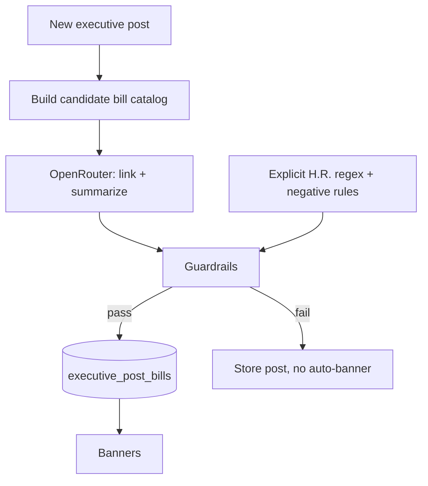

# Executive signals & Truth Social ingestion — planning handoff

Status: **planning only — not implemented**  
Last updated: 2026-06-25  
Purpose: Resume work in a future session. Captures user questions, research findings, product decisions under discussion, and a proposed implementation plan.

---

## User goals (original thread)

1. Understand whether project APIs cover **presidential actions** (veto vs informal statement) for the **21st Century ROAD to Housing Act (H.R. 6644)** story (Trump canceled signing ceremony, linked to SAVE Act).
2. Determine if **formal presidential actions** exist upstream and are ingestible.
3. Discuss ingesting **Trump Truth Social posts** to capture executive signal that Congress.gov does not record.
4. Show this on the website — **site-wide banner** and **per-bill banner** when relevant posts exist.
5. Design Truth Social ingestion and **prove it works** before full rollout.
6. Prefer **Option A**: executive signals tied to bills already in the feed (with nuance below).
7. **Discuss and plan first** — do not implement until plan is agreed.

---

## Key findings (research)

### What Trump did (H.R. 6644, June 2026)

- **Not a veto.** Trump canceled a planned **signing ceremony** and said he would not sign until Congress passes the **SAVE America Act**.
- He posted on **Truth Social** (multiple outlets attribute posts directly to Truth Social, not only generic “social media”).

**Representative Truth Social text (Jun 24, 2026):**

1. Earlier post — downplaying housing bill:  
   *“The Elizabeth ‘Pocahontas’ Warren centric housing bill, which is of minor importance compared to lower interest rates, and even FISA, pales in comparison to passing THE SAVE AMERICA ACT…”*

2. Main post — canceling ceremony:  
   *“Today’s Housing News Conference and Signing is hereby cancelled until such time as we pass the desperately needed SAVE AMERICA ACT, which I consider to be a National Emergency. Thank you for your attention to this matter! President DJT”*

### Congress.gov (upstream formal data)

Presidential steps **are formalized** on the same API the project already uses (`CONGRESS_API_KEY`):

| Endpoint | Use |
|----------|-----|
| `GET /v3/bill/{congress}/{type}/{number}/actions` | Full timeline incl. presidential milestones |
| `GET /v3/bill/...` → `latestAction` | Cheap snapshot |
| `GET /v3/law/{congress}/pub/{number}` | Post-enactment public law record |

**LOC action codes** (`sourceSystem.code === 9`) — authoritative list:  
https://www.congress.gov/help/field-values/action-codes

| Code | Meaning |
|------|---------|
| 28000 | Presented to President |
| 29000 | Signed by President |
| 31000 | Vetoed by President |
| 30000 | Pocket vetoed |
| 36000 | Became Public Law |
| 38000 | Public Law unsigned by President (10-day lapse) |

**H.R. 6644 live status (checked 2026-06-24/25):**  
- Latest action: House procedural step (Jun 23, 2026) — “Motion to reconsider laid on the table…”  
- **No** Presented / Signed / Vetoed / Became Public Law actions in full action list  
- **No** `laws` field on bill yet  

**Conclusion:** Ceremony cancellation and Truth Social posts are **not** in Congress.gov. Formal steps appear only when recorded in the legislative journal.

### What this project captures today

- **Ingests:** House/Senate **passage** roll-call votes, CRS summaries, AI digests.
- **Does not ingest:** Bill `/actions`, presidential milestones, Truth Social, White House statements.
- **President in UI:** Static `CURRENT_PRESIDENT` card only (`web/src/constants/president.ts`).

Relevant code:
- `workers/senate_data_worker/src/sources/congress-client.ts` — bill detail + summaries only (no `/actions`)
- `workers/senate_data_worker/src/pipeline/run-feed.ts` — passage votes + digests
- Feed item shape: `passage_votes`, `latest_passage_date` — no executive fields

### Congressional procedure (informal vs formal)

- After both chambers pass identical text: **enroll → present to President → 10-day window** (sign / veto / lapse).
- White House **signing ceremony** is optional; **presentation** is the formal constitutional step.
- Trump’s Truth Social statement does **not** change Congress’s post-passage pipeline.
- Congress can still enroll and present the bill; his statement affects **what he does after presentation**, not whether Congress sends it.

**News nuance:** At one point reporting noted the bill had **not yet been presented** to the President; leadership may delay sending enrolled text — worth monitoring via Congress.gov `28000` when it appears.

---

## Bills in the housing / SAVE story

| Bill | Title | Feed visibility today (45-day lookback) | Notes |
|------|-------|----------------------------------------|-------|
| **H.R. 6644** | 21st Century ROAD to Housing Act | **Yes** — Senate Jun 22, House Jun 23, 2026 | In test fixtures (`senate-vote-menu.sample.xml`) |
| **H.R. 22** | SAVE Act | **No** — House passed **2025-04-10**; Senate: “Received in the Senate” | Outside `VOTE_LOOKBACK_DAYS` (45); no recent Senate passage vote |
| **S. 2** | Secure America Act | Separate bill — became **PL 119-98** (Jun 2026) | **Do not conflate with SAVE Act (H.R. 22)** |

**Option A gap:** Strict “signals only on feed bills” shows **housing** in timeline but **not SAVE**, even though Trump links them. Site banner and/or **Option A+** (below) needed for full story.

---

## Product direction under discussion

### Option A (strict)

- Executive signals attach only to bills **already in the feed** (recent passage votes).
- SAVE Act (H.R. 22) gets **no bill-row banner** unless it enters feed or lookback changes.

### Option A+ (revised — dynamic bill hydration)

- Feed timeline still prioritizes **recent passage votes** (45-day lookback).
- **Additionally:** any bill Trump links in a post gets **hydrated into D1 on demand** (Congress.gov title, summary, passage votes, digest) even if outside the lookback — e.g. H.R. 22 (April 2025).
- Bills with **active executive signals** (e.g. last 14 days) **enter the feed/timeline** even when outside 45-day lookback, so SAVE gets its own row when he mentions it.
- Static watchlist **deprecated** — replaced by dynamic hydration + executive-signal feed boost.
- **Site banner** + **per-bill banners** on both primary and conditionally linked bills once hydrated.

### UI: two banner types

**1. Site-wide banner** (top of site, below header)

- For breaking executive context spanning multiple bills or mentioning non-feed bills.
- Placement: `PageShell` / `AppLayout` (below `SiteHeader`).
- All routes or home only — **open decision** (recommend all routes).
- Example copy pattern: President (Truth Social, date) + short summary + link out + disclaimer (*informal, not on Congress.gov*).

**2. Per-bill banner** (on feed row)

- When `executive_signals` linked to that bill.
- Collapsed row: compact chip (e.g. “Executive · Truth Social”).
- Expanded `FeedRowDetail`: full “Executive context” section above vote history.

**Later (Phase 5):** Congress.gov formal presidential actions on same rows — complementary lane labeled **formal** vs **informal**.

---

## Truth Social ingestion — proposed design

### Why

- Primary source for fast executive signal (housing/SAVE example).
- No official public API; Mastodon-compatible endpoints widely used (unofficial, fragile).

### Endpoints (unofficial)

```http
GET https://truthsocial.com/api/v1/accounts/lookup?acct=realDonaldTrump
GET https://truthsocial.com/api/v1/accounts/{id}/statuses?limit=40
```

**Spike result (2026-06-25):** Direct fetch from cloud dev environment returned **403 (Cloudflare)**. Production ingestion needs spike from Worker + fallback strategy.

### Alternative data sources (2026-06-25 discussion)

There is **no fully free, official, real-time Truth Social API**. These are the realistic options:

| Source | Cost | Worker reachable? | Captures informal posts (e.g. housing/SAVE)? | Notes |
|--------|------|-----------------|-----------------------------------------------|-------|
| **Truth Social Mastodon API** (`truthsocial.com/api/v1/...`) | Free | **No** (403 Cloudflare) | Yes, primary | Canonical but blocked from cloud/Worker IPs |
| **[trumpstruth.org](https://www.trumpstruth.org/)** archive | Free | **Yes** (HTTP 200) | **Yes** — Jun 24 housing/SAVE post indexed | Third-party archive (Defending Democracy Together); HTML only, no API; links to canonical Truth Social URLs |
| **White House** (`whitehouse.gov/briefings-statements`) | Free | Yes (HTML) | **Unlikely / slow** for ceremony cancellations | Official but informal Truth Social statements often never appear here |
| **GovInfo CPD** (`api.govinfo.gov`, free key) | Free | Yes (with `GOVINFO_API_KEY`) | **No** for informal; yes for formal sign/veto messages | Best for Phase 5 formal lane; repo already mentions `GOVINFO_API_KEY` in setup |
| **Congress.gov `/actions`** (existing key) | Free | Yes | **No** for informal; yes for Presented/Signed/Vetoed | Phase 5 formal lane |
| **RSS.app / RSSHub / Apify** | Freemium / paid | Varies | Yes | Still scrapes Truth Social behind the scenes; not truly free at scale |
| **External home poller → admin POST** | Free | N/A (bypasses block) | Yes | DIY; needs always-on residential machine |

**Recommended v1 fetch (free, Worker-native):** poll **trumpstruth.org** homepage HTML every 10 min, parse:

- `truthsocial.com/@realDonaldTrump/{mastodon_id}` → stable `post_id`
- `og:description` on `/statuses/{id}` pages (or list snippets) → post text
- `June 24, 2026, 10:26 AM` timestamps

Verified examples (housing/SAVE — Jun 24, 2026):

**Primary signal post (ceremony cancelled / signing delayed):**

| Field | Value |
|-------|-------|
| Archive | `https://www.trumpstruth.org/statuses/39514` |
| Truth Social | `https://truthsocial.com/@realDonaldTrump/116805545512296111` |
| Posted | June 24, 2026, 10:26 AM |
| Text | *“Today’s Housing News Conference and Signing is hereby cancelled until such time as we pass the desperately needed SAVE AMERICA ACT, which I consider to be a National Emergency. Thank you for your attention to this matter! President DJT”* |

**Earlier same-day context post (housing vs SAVE priority):**

| Field | Value |
|-------|-------|
| Archive | `https://www.trumpstruth.org/statuses/39511` |
| Truth Social | `https://truthsocial.com/@realDonaldTrump/116805400052068772` |
| Posted | June 24, 2026, 9:49 AM |
| Text | *“The Elizabeth ‘Pocahontas’ Warren centric housing bill… pales in comparison to passing THE SAVE AMERICA ACT…”* |

**Expected bill links after ingest + linker:**

- **H.R. 6644** (ROAD to Housing) — primary on post 39514 (`housing` / `signing cancelled` aliases)
- **H.R. 22** (SAVE Act) — related/conditional on both posts (`SAVE America Act` alias)
- **Not** S. 2 (Secure America Act) — negative rule

**Banner copy target (post 39514):** e.g. “President cancelled housing signing ceremony until SAVE Act passes (Truth Social, Jun 24)” on H.R. 6644 row + site banner; H.R. 22 as `related_executive_bills` on housing row.

**UI attribution:** “President · Truth Social” with links to **both** Truth Social (primary) and archive (secondary). Disclaimer: third-party archive, not Congress.gov.

**Tradeoffs vs direct Truth Social:** minutes of indexing delay; HTML scrape fragility; dependency on a third-party site; no SLA. Acceptable for breaking-news banners if latency is ~5–15 min, not seconds.

### Fetch tiers (revised — try in order)

1. **trumpstruth.org HTML poll from Worker** (free, confirmed reachable from cloud)  
2. Truth Social Mastodon API from Worker (likely 403; retry after header experiments)  
3. External poller or Apify → `POST /__pipeline/run/executive-posts` admin endpoint  
4. Manual seed / admin POST for known posts while automation is proven  

### Architecture

```text
Cron (Worker, every 5–15 min)
  → fetch new @realDonaldTrump posts
  → dedupe by Mastodon status id → D1 executive_posts
  → link to bills → D1 executive_post_bills
  → (optional) OpenRouter for ambiguous posts
  → GET /executive/alerts.json + enrich GET /feed/latest.json

Web
  → site banner from alerts
  → bill banner from per-item executive_signals
```

### Proposed D1 tables

**`executive_posts`**

- `id` (Mastodon snowflake, PK)
- `platform`, `author`, `text`, `posted_at`, `source_url`, `raw_json`, `ingested_at`

**`executive_post_bills`**

- `post_id`, `bill_congress`, `bill_type`, `bill_number`
- `link_method` (`keyword` | `alias` | `llm` | `manual`)
- `confidence`, `is_primary`

**`executive_bill_aliases`** (watchlist)

- Phrase → bill ref, e.g. `"SAVE America Act"` → H.R. 22, `"ROAD to Housing"` → H.R. 6644

### Bill linking mechanism (revised: LLM-primary + guardrails, not rules-first)

**User feedback (2026-06-25):** Rules-only matching is too brittle for Trump’s rhetoric (“Elizabeth Warren centric housing bill”, “SAVE America Act”, vague nicknames). We need semantic understanding, not just regex + a growing alias table.

**Decision:** **LLM-primary linking** with a **constrained candidate bill catalog** and **deterministic guardrails**. Still **not RAG** and **not a graph DB** at v1 scale.



#### Why LLM-primary?

Trump rarely cites `H.R. 6644`. He uses **marketing names, people, and policy shorthand**. Examples:

| Post language | Bill | Rules alone? |
|---------------|------|--------------|
| “Elizabeth Warren centric housing bill” | H.R. 6644 | Needs hand-maintained alias |
| “SAVE AMERICA ACT” | H.R. 22 | Needs alias; confusable with S. 2 |
| “Signing cancelled until… SAVE AMERICA ACT” | 6644 primary + 22 conditional | Needs **relationship** semantics |
| Future: “the border bill”, “Schumer’s disaster” | ??? | Alias table doesn’t scale |

An LLM with **bill titles + digest headlines** in context can infer what we want: *this post is about delaying the housing bill until SAVE passes*.

#### Why not RAG (yet)?

- **Candidate set is small:** ~50 feed bills + ~20 watchlist ≈ 70 bills. Fits in one prompt with title, policy area, digest headline/teaser.
- **RAG adds:** embeddings, vector storage, retrieval tuning, harder debugging.
- **Revisit RAG** if we expand candidates to “any bill in the 119th Congress” (~thousands).

#### Why not a graph DB?

- Relationships we care about (`primary`, `conditional`, `related`) fit as columns on `executive_post_bills`, output by the LLM.
- No multi-hop graph queries needed.

---

#### Step 1 — Candidate bill catalog (per post)

1. **Feed bills** — recent passage votes (45-day lookback) + **executive-boosted bills** (linked in last N days, even if older).
2. **Already-hydrated bills** — any bill previously pulled into D1 via executive linking (grows over time).
3. LLM may also propose `(congress, type, number)` from post text; unverified refs trigger **dynamic hydration** (below).

**Dynamic bill hydration (new):** when LLM links a bill not fully in D1:

1. `GET` Congress.gov bill + summaries → upsert `bill_digests`
2. Targeted passage-vote fetch for that bill → upsert `votes`
3. Digest rewrite if missing (OpenRouter, same as feed pipeline)
4. Bill becomes feed-eligible via executive-signal boost

Works for **any** bill Trump mentions indirectly — SAVE Act today, another stale bill tomorrow. No manual watchlist curation required.

**Feed vs DB:**

| | 45-day feed only | + dynamic hydration |
|--|------------------|---------------------|
| H.R. 6644 | In feed | In feed |
| H.R. 22 after Trump post | Missing | **Hydrated + appears in feed** (executive boost) |

```json
{ "congress": 119, "type": "HR", "number": 6644, "title": "...", "headline": "...", "policy_area": "Housing" }
```

This is **structured context injection**, not retrieval from a vector index.

---

#### Step 2 — LLM link + summarize (primary)

One OpenRouter call per **new** post (same stack as [`openrouter.ts`](../workers/senate_data_worker/src/synthesis/openrouter.ts), `temperature: 0`, JSON output).

**Prompt asks for:**

```json
{
  "linked_bills": [
    {
      "congress": 119, "type": "HR", "number": 6644,
      "role": "primary",
      "confidence": 0.95,
      "rationale": "Post cancels housing signing ceremony"
    },
    {
      "congress": 119, "type": "HR", "number": 22,
      "role": "conditional",
      "confidence": 0.92,
      "rationale": "Signing delayed until SAVE America Act passes"
    }
  ],
  "banner_summary": "Cancelled housing signing until SAVE Act passes",
  "informal": true
}
```

**Roles:** `primary` | `conditional` | `related` | `mentioned` — drives UI (primary row banner vs “also mentions”).

**Reuse:** Same `OPENROUTER_API_KEY` / free model selection as digest rewrite. At Trump’s post volume (~few/day), cost is negligible.

---

#### Step 3 — Guardrails (deterministic, not primary matcher)

LLM proposes; code verifies:

| Guardrail | Purpose |
|-----------|---------|
| **Closed world** | Discard any bill not in candidate catalog |
| **Confidence floor** | No auto-banner if top link `confidence < 0.75` (tune in tests) |
| **Explicit bill numbers** | If post contains `H.R. 6644`, that bill must appear in links or flag for review |
| **Negative rules** | Block known confusions: S. 2 (Secure America) when only “SAVE America Act” appears without S. 2 context |
| **Duplicate roles** | At most one `primary`; demote extras to `related` |
| **Missing API key** | Degraded mode: regex + minimal aliases only; log warning |

Guardrails prevent hallucinated bill numbers; they do **not** replace semantic matching.

---

#### Step 4 — Aliases table (optional seed only)

`executive_bill_aliases` optional for **guardrail hints** and test fixtures — not the primary way bills enter the system. Dynamic hydration replaces manual watchlist curation.

---

#### Rules-first (superseded for v1)

The earlier “Tier 1 rules / Tier 2 LLM optional” ordering is **reversed**. LLM is default; rules are safety rails.

**Housing/SAVE validation:** LLM should link 39514 → 6644 (primary) + 22 (conditional) using digest context; unit tests use fixture post text + fixture catalog.

### Proposed API shapes

**`GET /executive/alerts.json`**

```json
{
  "alerts": [
    {
      "post_id": "...",
      "posted_at": "2026-06-24T...",
      "summary": "Cancelled housing signing until SAVE Act passes",
      "source_url": "https://truthsocial.com/...",
      "linked_bills": [
        { "congress": 119, "type": "HR", "number": 6644, "title": "..." },
        { "congress": 119, "type": "HR", "number": 22, "title": "SAVE Act" }
      ],
      "informal": true
    }
  ]
}
```

**Extend `FeedItem` in feed response**

```json
{
  "executive_signals": [
    {
      "post_id": "...",
      "posted_at": "...",
      "summary": "...",
      "source_url": "...",
      "informal": true
    }
  ],
  "related_executive_bills": [
    {
      "congress": 119,
      "type": "HR",
      "number": 22,
      "title": "SAVE Act",
      "reason": "mentioned_in_same_post"
    }
  ]
}
```

Shared types should live in `shared/` (same pattern as `stats-api-types.ts`).

---

## Testing plan (before full UI ship)

### Phase 0 — Spike

- [ ] Can Cloudflare Worker reach Truth Social API?
- [ ] Document account ID stability, rate limits, response JSON shape
- [ ] Save 2–3 real responses as fixtures (redact if needed)

### Phase 1 — Backend unit tests (fixtures)

- [ ] Parse Mastodon status → `executive_posts` row
- [ ] Link Jun 24 post text → H.R. 6644 + H.R. 22
- [ ] Negative: “Secure America Act” → not H.R. 22
- [ ] Dedupe: same `post_id` ingested twice → one row

### Phase 2 — Integration tests

- [ ] Seed D1 with fixture posts + links
- [ ] `GET /executive/alerts.json` returns expected alerts
- [ ] Feed enrichment attaches signals to H.R. 6644 item
- [ ] Follow `workers/senate_data_worker/src/http/router.test.ts` patterns

### Phase 3 — Live poll (staging)

- [ ] Cron runs once; verify new post ingested
- [ ] Manual compare to truthsocial.com

### Phase 4 — UI + ship checklist

- [ ] Site banner + bill banner components
- [ ] `npm test`
- [ ] `npm run qa:web` (banner not clipped on mobile/desktop, light/dark)
- [ ] Thermonuclear review on branch diff
- [ ] `npm run preview` — paste Preview URL in PR and chat

---

## Implementation phases (suggested order)

| Phase | Deliverable | User-visible? |
|-------|-------------|---------------|
| **0** | Truth Social fetch spike + fixtures | No |
| **1** | D1 schema + ingest pipeline + linker + tests | No |
| **2** | `GET /executive/alerts.json` + feed enrichment | API only |
| **3** | Site banner + bill banner UI | **Yes** |
| **4** | Cron automation + monitoring | Yes |
| **5** | Congress.gov `/actions` presidential milestones (formal lane) | Yes |

**Defer Phase 5** until informal Truth Social lane is working — formal and informal should display with clear labels.

---

## Open decisions (user to confirm next session)

1. ~~**Strict Option A vs Option A+** (watchlist for H.R. 22 linking without feed entry)?~~ **Resolved:** dynamic bill hydration + executive-signal feed boost; no static watchlist.
2. **Site banner scope:** all routes (`/`, `/stats`) or home only?
3. **Launch strategy:** manual seed of Jun 24 posts for UI while Phase 0 spike runs?
4. **Vendor budget:** Apify or similar if Worker IP stays blocked?
5. ~~**LLM linking in v1:** rules-only first (recommended) or OpenRouter from day one?~~ **Resolved:** LLM-primary linking with guardrails; rules/aliases are safety rails only.
6. **Dismissible site banner** per session — v1 or v2?

---

## Related project constants & files

| Item | Location |
|------|----------|
| Vote lookback (45 days) | `workers/senate_data_worker/src/constants.ts` → `VOTE_LOOKBACK_DAYS` |
| Feed pipeline | `workers/senate_data_worker/src/pipeline/run-feed.ts` |
| Congress client (no actions yet) | `workers/senate_data_worker/src/sources/congress-client.ts` |
| Feed read model | `workers/senate_data_worker/src/storage/feed.ts` |
| Feed UI | `web/src/routes/Home.tsx`, `FeedRow.tsx`, `FeedRowDetail.tsx` |
| Page shell / header | `web/src/components/PageShell.tsx`, `SiteHeader.tsx` |
| H.R. 6644 fixture vote | `workers/senate_data_worker/src/fixtures/senate-vote-menu.sample.xml` |

---

## Alternative / complementary sources (not chosen as primary)

| Source | Pros | Cons |
|--------|------|------|
| White House statements | Official, citable | Incomplete vs Truth Social; often slower |
| Third-party Truth APIs (TrumpBot, ScrapeCreators, Apify) | Handles blocking | Cost, vendor lock-in, ToS gray area |
| News aggregators | Legal simplicity | Secondhand, weak bill linkage |

---

## Session checklist for implementer

1. Read this doc + user decisions on open questions above.
2. Run Phase 0 spike; document Worker vs proxy path in this file or a short `docs/EXECUTIVE_SIGNALS_SPIKE.md`.
3. Implement Phase 1–2 with tests before UI.
4. Seed Jun 24 Truth Social posts (manual or live) to validate H.R. 6644 + H.R. 22 linking.
5. Build banners; run full ship checklist for `web/` changes.
6. Optionally add Congress.gov presidential actions (Phase 5) as formal counterpart.

---

## References

- Congress.gov action codes: https://www.congress.gov/help/field-values/action-codes  
- Congress.gov API bill actions: `GET /v3/bill/{congress}/{type}/{number}/actions`  
- API maintainer guidance (use LOC `actionCode` where `sourceSystem` = 9): https://github.com/LibraryOfCongress/api.congress.gov/issues/45  
- H.R. 6644: https://www.congress.gov/bill/119th-congress/house-bill/6644  
- H.R. 22 (SAVE Act): https://www.congress.gov/bill/119th-congress/house-bill/22  
